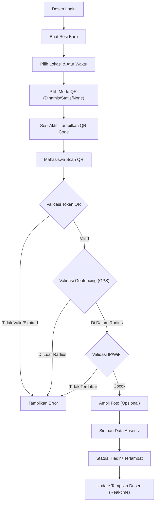

## 1. Ringkasan Produk
Sistem absensi berbasis web yang komprehensif, aman, dan modern untuk lingkungan akademik (kampus/sekolah) menggunakan teknologi QR code dinamis, geofencing, dan validasi IP/WiFi.
Sistem ini bertujuan untuk mempermudah dosen/admin dalam mengelola sesi kehadiran dan mahasiswa/user dalam melakukan absensi dengan validasi yang ketat untuk mencegah kecurangan, serta menyajikan rekap data kehadiran secara real-time.

## 2. Fitur Inti

### 2.1 Peran Pengguna
| Peran | Metode Pendaftaran | Izin Inti |
|------|---------------------|------------------|
| SUPER_ADMIN | Dibuat melalui database/seeder | CRUD semua pengguna, assign role, reset password, import user, akses log audit, pengaturan sistem global |
| ADMIN | Dibuat oleh SUPER_ADMIN | Membuat/mengelola sesi absensi, melihat daftar pengguna (tidak bisa edit role/hapus), tambah pengguna baru (role USER) |
| USER | Dibuat oleh ADMIN/SUPER_ADMIN | Melakukan absensi (check-in/check-out), melihat rekap kehadiran pribadi |

### 2.2 Modul Fitur
1. **Halaman Landing**: hero section, informasi fitur unggulan, panduan cara kerja, akses masuk (login).
2. **Autentikasi**: login, lupa password, manajemen sesi login aktif (one-device policy).
3. **Dashboard (Admin & User)**: ringkasan statistik, grafik kehadiran, sesi terdekat.
4. **Manajemen Pengguna (Admin)**: daftar pengguna, filter, pencarian, CRUD pengguna, import CSV/Excel.
5. **Manajemen Lokasi (Admin)**: pembuatan geofencing dengan integrasi peta (Leaflet), radius, dan daftar IP/WiFi.
6. **Manajemen Sesi (Admin)**: pembuatan sesi absensi dengan QR code (dinamis/statis/tanpa QR), jadwal, dan toleransi keterlambatan.
7. **Absensi (User)**: pemindaian QR code, validasi lokasi (GPS) dan IP, pengambilan foto bukti (opsional).
8. **Laporan & Export**: rekap kehadiran terperinci, ekspor ke format Excel dan PDF.
9. **Pengaturan**: pengaturan profil, preferensi tampilan (light/dark mode), dan pengaturan sistem (Super Admin).

### 2.3 Detail Halaman
| Nama Halaman | Nama Modul | Deskripsi Fitur |
|-----------|-------------|---------------------|
| Landing Page | Hero, Fitur, Footer | Menyajikan informasi sistem dan tombol CTA untuk Login. Mendukung light/dark mode. |
| Login Page | Form Login | Form email dan password, link lupa password, validasi satu perangkat (device fingerprint). |
| Dashboard | Statistik, Grafik | Menampilkan ringkasan kehadiran hari ini, persentase hadir, dan jadwal sesi terdekat. |
| Manajemen Pengguna | Tabel Pengguna, Form | Tabel daftar pengguna dengan paginasi, tombol tambah, edit, hapus, import, dan ubah role. |
| Manajemen Lokasi | Peta Interaktif, Form | Peta Leaflet untuk memilih titik koordinat, input alamat (geocoding), slider radius, input daftar IP. |
| Manajemen Sesi | Tabel Sesi, Form | Membuat jadwal kelas/event, mengatur mode QR, batas waktu check-in, dan assigned user. |
| Tampilan QR Dosen | QR Display | Menampilkan QR Code besar yang diperbarui secara real-time (Socket.io), jumlah peserta absen. |
| Form Absensi (Scan) | QR Scanner, Map | Membuka kamera untuk scan QR, menampilkan mini map lokasi pengguna vs area geofencing. |
| Riwayat/Rekap | Tabel Rekap | Tabel rekap kehadiran per sesi atau per pengguna, dengan opsi filter dan ekspor (Excel/PDF). |
| Pengaturan | Form Profil, Sistem | Edit profil pribadi dan (khusus Super Admin) mengatur konfigurasi global sistem. |

## 3. Proses Inti
Proses utama adalah alur pembuatan sesi oleh Dosen/Admin dan absensi oleh Mahasiswa/User.

## 4. Desain Antarmuka Pengguna
### 4.1 Gaya Desain
- **Warna Primer dan Sekunder**: Menggunakan palet biru profesional (misal: Indigo/Blue) sebagai warna primer, dengan abu-abu netral (Zinc/Slate) sebagai warna sekunder. Hijau untuk sukses, merah untuk error/alfa, kuning/oranye untuk peringatan/terlambat.
- **Gaya Tombol**: Sudut sedikit membulat (rounded-md atau rounded-lg), variasi solid, outline, dan ghost. Interaksi hover yang jelas dengan transisi halus.
- **Font dan Ukuran**: Menggunakan font modern dan bersih seperti 'Inter' atau 'Plus Jakarta Sans'. Hirarki ukuran teks yang jelas (text-xs hingga text-3xl).
- **Gaya Tata Letak**: Layout dashboard dengan sidebar di kiri (bisa dilipat) dan navbar di atas. Konten utama dalam bentuk kartu (card-based layout) dengan bayangan halus (shadow-sm).
- **Saran Gaya Ikon/Emoji**: Menggunakan pustaka Lucide React untuk ikon yang konsisten, bergaris tipis, dan profesional.
- **Dark Mode**: Dukungan penuh untuk tema gelap menggunakan Tailwind dark mode class strategy, warna latar belakang bergeser ke dark slate/zinc yang elegan.

### 4.2 Ringkasan Desain Halaman
| Nama Halaman | Nama Modul | Elemen UI |
|-----------|-------------|-------------|
| Dashboard | Statistik | Kartu metrik, Line Chart (Recharts), Doughnut Chart status kehadiran, daftar sesi terbaru. |
| Lokasi | Peta | Komponen Leaflet peta interaktif, form input alamat di atas peta, slider untuk mengatur radius area. |
| QR Dosen | Display | QR Code besar di tengah layar, timer lingkaran untuk refresh (dinamis), list peserta real-time di sisi kanan. |
| Scan Absensi | Kamera | Video feed kamera layar penuh (mobile) atau di dalam kartu (desktop), overlay kotak pemindai, tombol switch kamera. |

### 4.3 Responsivitas
- **Desktop-first**: Dirancang awal untuk tampilan layar lebar (dashboard dosen/admin).
- **Mobile-adaptive**: Halaman pemindaian QR dan form absensi dioptimalkan secara khusus untuk pengalaman pengguna mobile (mahasiswa), karena proses absensi dilakukan via HP. Tabel yang panjang akan mendukung scroll horizontal atau berubah bentuk menjadi daftar kartu pada layar kecil.
- **Touch optimization**: Tombol aksi dan area klik dibuat cukup besar (minimal 44x44px) untuk kemudahan sentuhan pada perangkat seluler.
