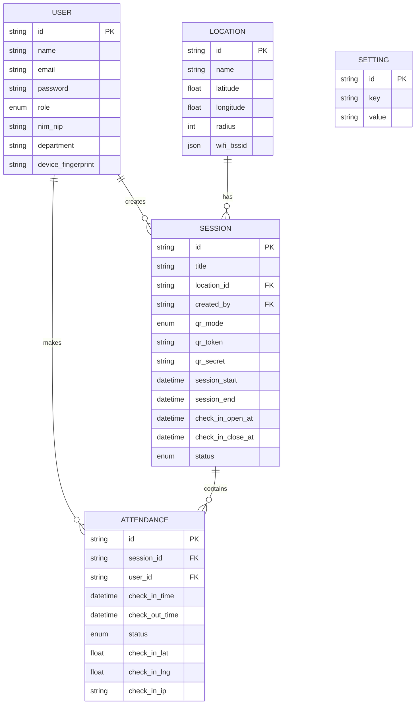

## 1. Desain Arsitektur

```mermaid
graph TD
    subgraph Frontend [Klien (React + Vite)]
        A[Komponen UI] --> B[Zustand Store]
        B --> C[Axios HTTP Client]
        A --> D[Leaflet Map]
        A --> E[QR Scanner/Generator]
        A --> F[Socket.io Client]
    end

    subgraph Backend [Server (Node.js + Express)]
        C --> G[Express Router]
        F --> H[Socket.io Server]
        G --> I[Controllers]
        I --> J[Services & Utils]
        I --> K[Prisma ORM]
        H --> K
    end

    subgraph Data [Basis Data]
        K --> L[(PostgreSQL)]
    end

    subgraph External [Layanan Eksternal]
        J --> M[Geocoding API]
        J --> N[Email SMTP]
    end
```

## 2. Deskripsi Teknologi
- **Frontend**: React.js dengan TypeScript, Vite sebagai build tool, Tailwind CSS, shadcn/ui untuk komponen antarmuka, Zustand untuk manajemen status. Pustaka tambahan: React Router v6, Axios, react-leaflet (peta), qrcode.js (pembuat QR), html5-qrcode (pemindai QR), recharts (grafik), lucide-react (ikon).
- **Backend**: Node.js dengan kerangka kerja Express.js, TypeScript. Pustaka tambahan: Prisma ORM (database interaksi), bcrypt (hashing kata sandi), jsonwebtoken (autentikasi), socket.io (komunikasi waktu nyata), node-cron (penjadwal tugas), multer (opsional: unggah foto).
- **Basis Data**: PostgreSQL, diatur menggunakan Prisma Schema.
- **Alat Inisialisasi**: pnpm untuk manajemen dependensi, menggunakan template react-express-ts.

## 3. Definisi Rute

### Rute Frontend (React Router)
| Rute | Tujuan |
|-------|---------|
| `/` | Halaman Landing Page (Publik) |
| `/login` | Halaman masuk (Login) |
| `/forgot-password` | Form lupa kata sandi |
| `/dashboard` | Dashboard utama Admin/Dosen |
| `/users` | Manajemen pengguna (Super Admin/Admin) |
| `/locations` | Daftar dan pembuatan geofencing lokasi |
| `/sessions` | Manajemen sesi kelas/event |
| `/sessions/:id/qr` | Tampilan QR Code besar untuk dosen (Mode Dosen) |
| `/attend` | Halaman absensi mahasiswa (Pemindai QR/Form) |
| `/my-attendance` | Laporan kehadiran pribadi (Mahasiswa) |
| `/reports` | Rekap kehadiran keseluruhan dan ekspor (Admin) |
| `/settings` | Pengaturan profil dan sistem |

## 4. Definisi API

**Auth Endpoints:**
- `POST /api/auth/login`: Autentikasi dengan email & password. Mengembalikan `accessToken`. `refreshToken` diatur dalam HttpOnly Cookie.
- `POST /api/auth/logout`: Membatalkan sesi token saat ini.
- `POST /api/auth/refresh`: Menghasilkan ulang `accessToken` baru dari `refreshToken` yang valid.

**Users Endpoints:**
- `GET /api/users`: Mendapatkan daftar pengguna dengan paginasi.
- `POST /api/users`: Membuat pengguna baru.
- `GET /api/users/:id`: Mengambil detail pengguna tertentu.
- `PUT /api/users/:id`: Memperbarui data atau peran pengguna.
- `DELETE /api/users/:id`: Menghapus pengguna (Soft delete/Hard delete).

**Locations Endpoints:**
- `GET /api/locations`: Daftar semua lokasi terdaftar.
- `POST /api/locations`: Menambahkan lokasi geofencing baru (nama, lat, lng, radius, daftar IP).
- `PUT /api/locations/:id`: Memperbarui titik koordinat/radius lokasi.

**Sessions Endpoints:**
- `GET /api/sessions`: Daftar jadwal sesi.
- `POST /api/sessions`: Membuat sesi baru beserta konfigurasi waktu check-in, lokasi, dan mode QR.
- `GET /api/sessions/:id/qr`: Mendapatkan atau menghasilkan token QR untuk sesi tertentu.
- `GET /api/sessions/:id/attendances`: Mengambil semua daftar kehadiran pada sesi ini.

**Attendance Endpoints:**
- `POST /api/attendance/check-in`: Mengirim payload (qr_token, lat, lng, device_info). Divalidasi di backend.
- `GET /api/attendance/report/export`: Mengunduh laporan rekapitulasi (XLSX/PDF).

## 5. Diagram Arsitektur Server

```mermaid
graph TD
    Req[HTTP Request] --> Auth[Middleware Auth & RBAC]
    Auth --> Router[Express Router]
    Router --> Ctrl[Controller (Validasi Input)]
    Ctrl --> Svc[Service Layer (Logika Bisnis)]
    Svc --> Repo[Prisma Client (Data Access)]
    Repo --> DB[(PostgreSQL)]
    
    Sock[WebSocket Connection] --> SockAuth[Socket Auth Middleware]
    SockAuth --> SockHandler[Socket Event Handler]
    SockHandler --> Svc
```

## 6. Model Data
### 6.1 Definisi Model Data



### 6.2 Data Definition Language (DDL)
DDL akan dikelola secara otomatis oleh Prisma ORM melalui `schema.prisma`. Migrasi database dijalankan dengan `npx prisma migrate dev`. Skema inti meliputi tabel `User`, `Location`, `Session`, `Attendance`, `AuditLog`, `Notification`, dan `Settings`.
