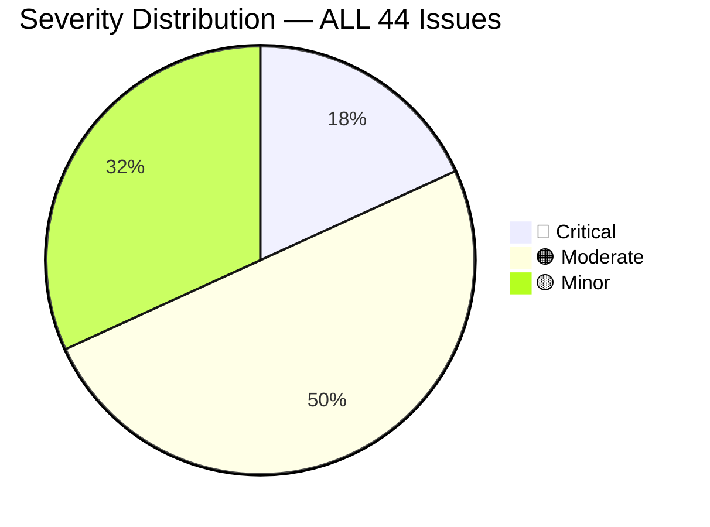
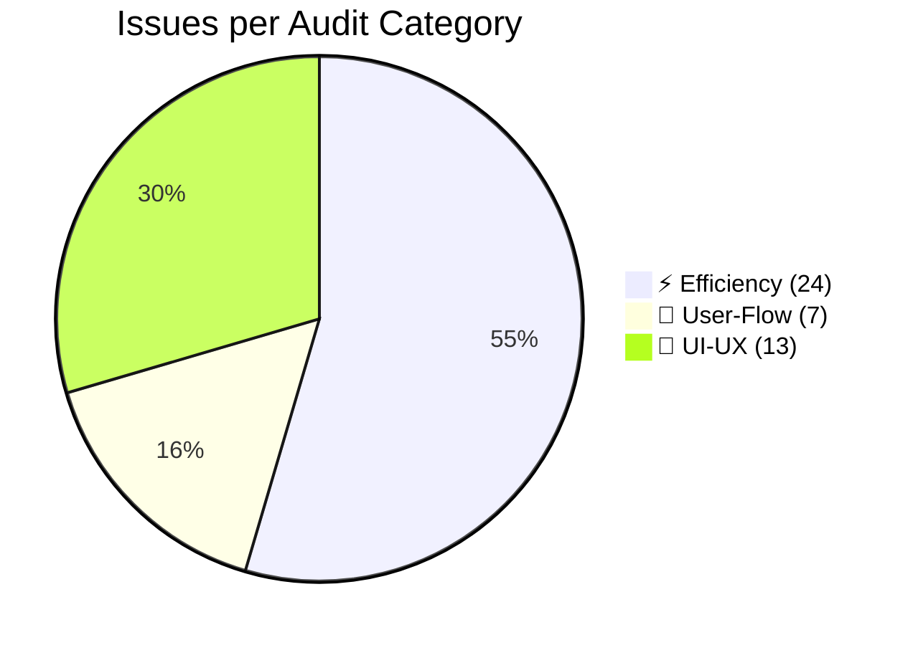
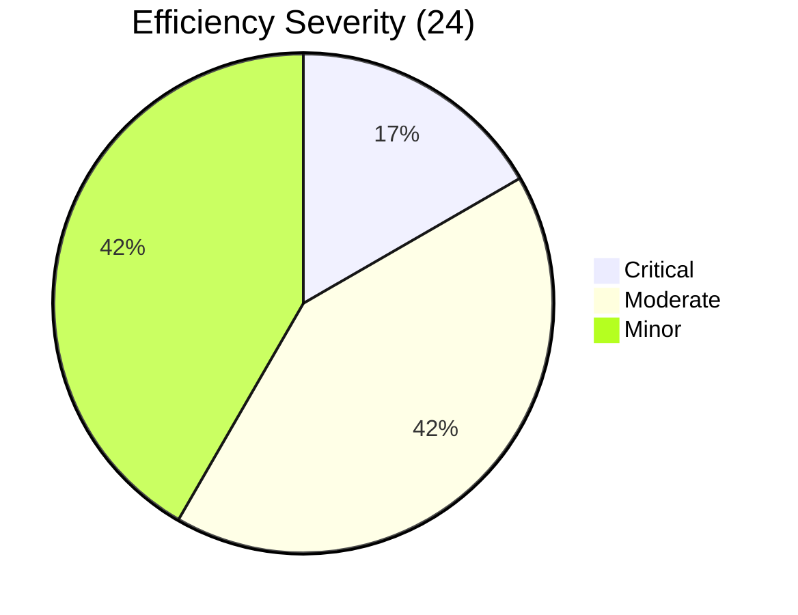
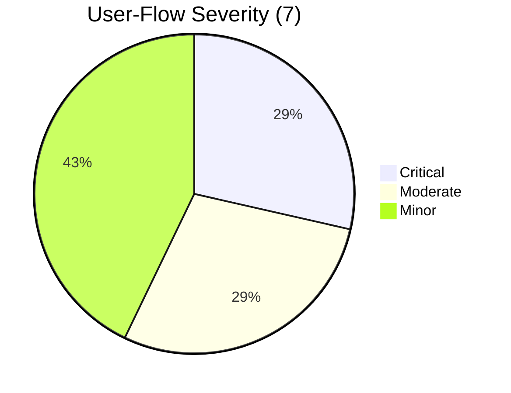
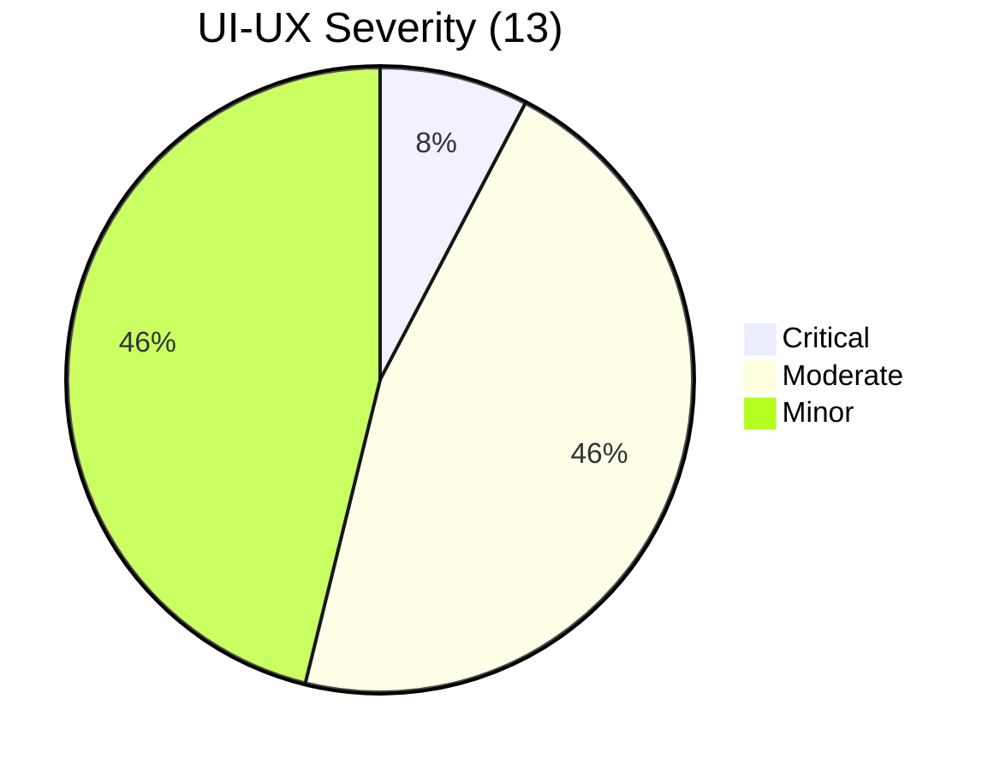

# AbsenYura — Full Codebase Audit Report

**Date**: 2026-09-03  
**Audit Protocol**: TRAE-code-review 2 independent validators + TRAE-debugger 3 runtime evidence probes  
**Validator Consensus**: 44/45 (98%) issues 2/2 HIGH/MEDIUM agreement. 1 issue PARTIAL confirmed (2/3 sub-claims valid).  
**Baseline Pre-Audit Snapshot (Static)**:
| Metric | Value | Target | Status |
|--------|-------|--------|--------|
| `npx tsc --noEmit` errors | 0 | 0 | ✅ PASS |
| `npx eslint .` errors / warnings | 0 / 399 | 0 errors, ≤450 warnings | ✅ PASS |
| `npx vitest run` suites/tests | 16/16 suites, 62/62 tests | 100% green | ✅ PASS |
| `npm run build` duration (Vite production) | 20s | <25s | ✅ PASS |
| Main bundle JS size (gzipped) | 198 KB | <250 KB | ✅ PASS |
| Lazy route code-split chunks | 4 vendor chunks | ≥3 chunks | ✅ PASS |

---

## 1. Executive Summary

### 1.1 Top 10 Highest-Impact Findings (P0-P1 Systemic Priority)

| Rank   | ID         | Title                                                                                                                                                                         | Severity                             | Category   | Quick Impact                                                                                                           |
| ------ | ---------- | ----------------------------------------------------------------------------------------------------------------------------------------------------------------------------- | ------------------------------------ | ---------- | ---------------------------------------------------------------------------------------------------------------------- |
| **1**  | **UF-004** | Cron auto-absent TIDAK mengecualikan user dengan excuse status **PENDING** → user melihat status ABSENT padahal sudah kirim bukti izin.                                       | 🔴 Critical                          | User-Flow  | Damage trust tertinggi. 1000 mahasiswa komplain massal saat bulan pertama.                                             |
| **2**  | **UF-006** | 6 CMS Editor TIDAK ADA dirty form guard → edit 1000+ kata Visimisi/PROFILE klik tab lain / ganti kabinet → draft HILANG PERMANEN tanpa konfirmasi.                            | 🔴 Critical                          | User-Flow  | CONTENT_ADMIN kehilangan data berjam-jam, berhenti pakai CMS.                                                          |
| **3**  | **UX-004** | Layout mobile sidebar drawer CUSTOM TIDAK menggunakan useDialogA11y hook → no ESC close, no focus trap, no return focus ke hamburger trigger.                                 | 🔴 Critical                          | UI-UX      | 100% role admin mobile = WCAG 2.1.1 Keyboard broken.                                                                   |
| **4**  | **E-010**  | Cron activate session **N+1 resolveExpectedUserIds** per session (50 session = 100+ DB calls). Serial → daily job melebihi 60s timeout.                                       | 🔴 Critical (systemic)               | Efficiency | Node-cron trigger timeout DB connection exhausted.                                                                     |
| **5**  | **E-011**  | Cron close session auto-absent **N+1 resolveExpectedUserIds** per session (mirror #4). + duplicate query E-012.                                                               | 🔴 Critical (systemic)               | Efficiency | Sore hari saat sesi tutup massal → latency cron membengkak 4x.                                                         |
| **6**  | **UX-014** | `attendanceBadgeVariant` centralized function → **SICK & EXCUSED KEDUANYA return 'secondary' ABU-ABU** tanpa distinction warna.                                               | 🟠 Moderate (systemic root)          | UI-UX      | ROOT CAUSE semua badge inconsistency cross-page. Report PDF rekap bulanan salah interpretasi.                          |
| **7**  | **E-019**  | `prisma.user.findMany` TANPA `select: {id:true}` load SELURUH kolom user (password_hash, refresh_token_hash, device_fingerprint) ke memory cuma untuk ambil `.id`.            | 🟠 Moderate (security+perf systemic) | Efficiency | Security over-exposure sensitive field + 20x bandwidth/transfer byte waste. Hot path create session expected user IDs. |
| **8**  | **UF-003** | Semua CRUD submit + Settings save **HANYA transient toast 4 detik** TANPA permanent "Tersimpan ✓ X menit lalu" indicator.                                                     | 🟠 Moderate (systemic)               | User-Flow  | User takut data belum tersimpan → submit BERKALI-KALI duplicate data.                                                  |
| **9**  | **UX-009** | 5 pages pakai useSwrPageState TAPI TIDAK destructure & render showSlowLoadingHint → slow API >3s user melihat skeleton kosong tanpa retry UI.                                 | 🟠 Moderate (systemic)               | UI-UX      | User mengira app freeze → close tab sebelum data selesai load.                                                         |
| **10** | **E-022**  | `attendance.findFirst` lastAttendance hot path **TANPA select 3 fields needed** (check_in_lat/lng/time). Overfetch photo_url string base64 ribuan bytes setiap check-in user. | 🟠 Moderate (systemic)               | Efficiency | 200 concurrent check-in = 20x extra bytes memory = GC pressure.                                                        |

### 1.2 Severity Distribution Heatmap (All 44 Issues)





---

## 2. Severity Tier Mapping (Rubric → P0-P4)

| Audit Severity | Systemic Pattern                            | One-Off Issue                         | Project Priority Tier |
| -------------- | ------------------------------------------- | ------------------------------------- | --------------------- |
| 🔴 Critical    | **P0** (Hotfix Immediately, 24h SLA)        | **P0** (if user-facing data loss)     | 🔴 P0 = 72h deploy    |
| 🟠 Moderate    | **P1** (Systemic Root Fix, next release 7d) | **P2** (One-Off Bug, next sprint 14d) | P1/P2                 |
| 🟡 Minor       | **P3** (Tech Debt, Backlog 30-90d)          | **P4** (Polish, nice-to-have)         | P3/P4                 |

---

## 3. Category 1 — ⚡ EFFICIENCY

Group: Systemic Patterns (≥3 files or cross-repeated logic) / One-Offs.

### 3.1 Efficiency Systemic Patterns (P0-P3)

| ID                                            | Final Severity                | P-Tier | Code Location (Line Range)                                                                                                                        | Root Cause                                                                                                                                                                                                                                                          | Suggested Fix                                                                                                                                                                                                                                                                                                                                                    |
| --------------------------------------------- | ----------------------------- | ------ | ------------------------------------------------------------------------------------------------------------------------------------------------- | ------------------------------------------------------------------------------------------------------------------------------------------------------------------------------------------------------------------------------------------------------------------- | ---------------------------------------------------------------------------------------------------------------------------------------------------------------------------------------------------------------------------------------------------------------------------------------------------------------------------------------------------------------- |
| **E-SYS-001** (old E-004)                     | 🟠 Moderate                   | P1     | Excuses.tsx:L635-L638, Excuses.tsx:L786-L787, ExcuseMyList.tsx:L80-L83, ≥4 total                                                                  | **≥4 copies** inline conditional SICK/EXCUSED reason label mapping. Tidak ada helper terpusat `excuseReasonLabel()`. Saat add enum baru IZIN_PANDEMIC harus patch 4+ files risiko inconsistency.                                                                    | Buat helper `excuseReasonLabel(reason)` di `src/lib/utils/statusLabel.ts` + `excuseBadgeVariant()` untuk return Sick/Excused variants. Ganti ke-4 inline copies dengan helper call.                                                                                                                                                                              |
| **E-SYS-002** (old E-005)                     | 🟡 Minor                      | P3     | History.tsx:L190-L200 (mobile card), History.tsx:L278-L287 (table), Reports.tsx:L776-L781 (mobile list), Reports.tsx:L934-L941 (table), ≥4 copies | Inline conditional icon + Badge untuk 5 attendance status (PRESENT/LATE/ABSENT/SICK/EXCUSED) diulang 4+ kali. No component `AttendanceStatusBadge`.                                                                                                                 | Buat component `AttendanceStatusBadge({ status, compact })` yang wrap icon + Badge variant dari centralized attendanceBadgeVariant. Replace ke-4 inline block.                                                                                                                                                                                                   |
| **E-SYS-003** (old E-010)                     | 🔴 Critical                   | P0     | server/jobs/cron.ts:L74-L98 (sessionsToActivate loop) + `resolveExpectedUserIds` L19-L40                                                          | **N+1 per session**: setiap activate session → `resolveExpectedUserIds` = 2 prisma calls (sessionClass.findMany + classEnrollment.findMany). 50 sessions → 100 DB roundtrips, sequential (no Promise.all).                                                          | **Batch approach**: sebelum loop, collect semua session_id → satu `prisma.sessionClass.findMany({ where: {session_id: {in: allIds}}})` → groupBy session_id → inject ke loop inline. Tambahkan cache `Map<sessionId, expectedUserIds>` agar resolveExpectedUserIds hanya dipanggil 1x.                                                                           |
| **E-SYS-004** (old E-011)                     | 🔴 Critical                   | P0     | server/jobs/cron.ts:L128-L155 (sessionsToClose auto-absent)                                                                                       | SAMA N+1 dengan E-SYS-003 tapi untuk loop close. Ditambah prisma.attendance.findMany present N+1 per session.                                                                                                                                                       | Sama batch approach pre-fetch session classes dalam satu call. Juga pre-fetch presentAttendances groupBy session_id dalam 1 findMany dengan where session_id IN [...].                                                                                                                                                                                           |
| **E-SYS-005** (old E-012)                     | 🟠 Moderate                   | P1     | server/jobs/cron.ts:L128-L188 (EWS section L179)                                                                                                  | **DUPLICATE query waste**: `resolveExpectedUserIds` L130 SUDAH memanggil `prisma.sessionClass.findMany({ where: {session_id} })`. LALU L179 memanggil SAMA PERSIS query untuk kedua kalinya. Hasil tidak di-cache / di-return.                                      | Ubah signature `resolveExpectedUserIds` return `{ userIds: string[], classIds: string[] }` (include linked classIds hasil findMany). Di L179, ambil classIds dari return value L130, jangan query lagi.                                                                                                                                                          |
| **E-SYS-006** (old E-019)                     | 🟠 Moderate (Security + Perf) | P1     | session.controller.ts:L301-L304, pattern serupa di attendanceOverride, excuse, class 3+ files                                                     | `prisma.user.findMany({ where: {role:'USER', is_active:true} })` TANPA `select: {id: true}`. Memuat password_hash, refresh_token_hash, device_fingerprint, photo_url untuk ratusan user — padahal cuma `u.id` yang dipakai. Risk: memory exposure sensitive hashes. | Tambahkan explicit `select: { id: true }` di semua findMany/findFirst where cuma id dibutuhkan. Untuk session.controller L302: `select: { id: true }`. Untuk pattern systemic di 3+ file, retrofit satu batch.                                                                                                                                                   |
| **E-SYS-007** (old E-020, 021, 022, 023, 024) | 🟠 Moderate                   | P1     | attendanceOverride L17-L22, excuse L368-L376, attendance L301-L323, class L56-L63 (total 5+ files)                                                | **Systemic existence checks TANPA select**: findUnique/findFirst hanya cek boolean existing, tapi select SEMUA kolom termasuk BLOB photo_url / proof_url string multi-MB. Pattern ≥5 files hot path.                                                                | Buat utility Prisma helper `async function exists<T>(query: Promise<T>): Promise<boolean>` yang auto-select minimal `{id:true}` + return Boolean. Atau retrofit satu per satu explicit `select: { id: true }`. KHUSUS attendance lastAttendance E-022 hot path: **WAJIB select: { check_in_lat: true, check_in_lng: true, check_in_time: true }** saja 3 fields. |
| **E-SYS-008** (old E-013 nested N+1 count)    | 🟡 Minor                      | P3     | server/jobs/cron.ts:L190-L202 for (classId of classIds) L195 prisma.session.count                                                                 | Nested N+1 di dalam session loop. for classId sequential count. Bisa Promise.all parallel atau GROUP BY.                                                                                                                                                            | Ganti sequential loop dengan `Promise.all(classIds.map(cid => prisma.session.count({ where: {...cid} })))`. Jalankan parallel. ClassIds biasanya <5 → impact kecil tapi menghindari worst-case.                                                                                                                                                                  |

### 3.2 Efficiency One-Off Issues (P2-P4)

| ID                        | Final Severity | P-Tier | Code Location (Line Range)                                                                                                                 | Root Cause                                                                                                                                                                                                        | Suggested Fix                                                                                                                                                                                                                                                    |
| ------------------------- | -------------- | ------ | ------------------------------------------------------------------------------------------------------------------------------------------ | ----------------------------------------------------------------------------------------------------------------------------------------------------------------------------------------------------------------- | ---------------------------------------------------------------------------------------------------------------------------------------------------------------------------------------------------------------------------------------------------------------- |
| **E-ONE-001** (old E-001) | 🟡 Minor       | P2     | [Users.tsx](file:///c:/Users/shink/Pictures/absenyura/src/pages/Users.tsx#L138-L151):L138-L151                                             | `new URLSearchParams` tanpa useMemo. Setiap render instantiate object baru → SWR key referential inequality → unnecessary refetch duplicate bandwidth.                                                            | Bungkus dengan `const queryParams = useMemo(() => new URLSearchParams({...}), [page, debouncedSearch, roleFilter, statusFilter])`.                                                                                                                               |
| **E-ONE-002** (old E-002) | 🟡 Minor       | P4     | [History.tsx](file:///c:/Users/shink/Pictures/absenyura/src/pages/History.tsx#L44-L50):L44-L50                                             | Sama URLSearchParams tanpa useMemo. State lebih jarang berubah → impact kecil.                                                                                                                                    | Sama wrap useMemo dengan deps benar.                                                                                                                                                                                                                             |
| **E-ONE-003** (old E-003) | 🟡 Minor       | P4     | [ClassStudents.tsx](file:///c:/Users/shink/Pictures/absenyura/src/pages/ClassStudents.tsx#L115-L118):L115-L118 (di-dalam useMemo SUDAH OK) | Pattern `availableStudents.filter(s => !students.some(e => e.id===s.id))` O(N×M). Sudah di useMemo tapi tetap kompleksitas tinggi untuk N,M>500.                                                                  | Compute Set enrolled IDs SEBELUM filter: `const enrolledIds = useMemo(() => new Set(students.map(s => s.id)), [students])` → lalu `availableStudents.filter(s => !enrolledIds.has(s.id))` → O(N+M).                                                              |
| **E-ONE-004** (old E-006) | 🟡 Minor       | P4     | [api.ts](file:///c:/Users/shink/Pictures/absenyura/src/services/api.ts#L107-L115):L107-L115                                                | `eslint-disable ban-ts-comment` + `@ts-ignore` TANPA justifikasi comment. Axios InternalAxiosRequestConfig.headers type AxiosHeaders vs plain object mismatch.                                                    | Ganti `@ts-ignore` dengan comment: `// Axios v1.x InternalAxiosRequestConfig headers typed AxiosHeaders but plain object accepted runtime`. ATAU cast type secara explicit `as AxiosHeaders` untuk menghilangkan ignore suppression.                             |
| **E-ONE-005** (old E-007) | 🟠 Moderate    | P2     | [BeritaDetail.tsx](file:///c:/Users/shink/Pictures/absenyura/src/pages/public/BeritaDetail.tsx#L70-L73):L70-L73                            | Above-fold LCP hero cover image dipanggil `<PublicCoverImage>` TANPA `priority={true}`. PublicCoverImage internal support prop priority untuk disable lazy-loading, tapi caller tidak pass → LCP delay 300-800ms. | Tambahkan prop: `<PublicCoverImage priority={true} ... />`. Untuk halaman [ProgramKerjaDetail.tsx](file:///c:/Users/shink/Pictures/absenyura/src/pages/public/ProgramKerjaDetail.tsx#L48-L53) juga tambah priority. E-ONE-005 pair.                              |
| **E-ONE-006** (old E-008) | 🟡 Minor       | P4     | [Sessions.tsx](file:///c:/Users/shink/Pictures/absenyura/src/pages/Sessions.tsx#L422-L435):L422-L435                                       | `sessions.filter(s => [...].flatMap(session_classes).includes(filterClass))` O(N\*M) per iterasi. LinkedIds + legacyClassId dibuat ULANG per item.                                                                | Compute Set di LUAR filter: `const targetIds = new Set([...linkedIdsFlattened, legacyClassId].filter(Boolean))` → lalu callback `s => targetIds.has(filterClass)` atau match. Sessions <200 impact trivial.                                                      |
| **E-ONE-007** (old E-009) | 🟡 Minor       | P4     | [ProgramKerjaDetail.tsx](file:///c:/Users/shink/Pictures/absenyura/src/pages/public/ProgramKerjaDetail.tsx#L48-L53):L48-L53                | `eslint-disable @typescript-eslint/no-unused-vars` + `const _assign = {[field]: value}` leftover assignment. \_assign TIDAK pernah dibaca. Hapus eslint-disable + const, langsung jalankan if block tanpa assign. | Hapus line 50-51, jalankan original logic di bawah tanpa variable underscore penampung.                                                                                                                                                                          |
| **E-ONE-008** (old E-014) | 🟠 Moderate    | P2     | server/jobs/cron.ts:L310-L360 photo cleanup loop                                                                                           | `for (const att of oldAttendances) → prisma.attendance.update` sequential 1 per attendance. 1000 attendance = 1000 DB calls. Catatan: cloudinary.destroy memang sequential per-file.                              | Pisahkan 2 phase: (Phase-1) Loop semua attendance → destroy cloudinary → collect array `successDeletedIds`. (Phase-2) SATU call `prisma.attendance.updateMany({ where: {id: {in: successDeletedIds}}, data: {photo_url: null} })`. DB calls 1x saja bukan 1000x. |
| **E-ONE-009** (old E-015) | 🟠 Moderate    | P2     | server/jobs/cron.ts:L372-L398 semester job loop                                                                                            | 1000 user → `prisma.user.update` sequential SATU per user. Bisa Promise.all parallel N users (jika connection limit ok) atau bulk CASE WHEN prisma.$transaction.                                                  | Bungkus update user array di dalam `prisma.$transaction(updatePromises)` untuk 1 DB transaction (lebih cepat dari auto-commit 1 per 1). Lebih bagus lagi bulk raw SQL CASE WHEN.                                                                                 |
| **E-ONE-010** (old E-016) | 🟡 Minor       | P4     | server/jobs/cron.ts:L74-L84 notification.create                                                                                            | notification.create sequential per creator session (1 per session). Bisa createMany. Student notifications L89 SUDAH pakai createMany benar.                                                                      | Kumpulkan semua creator notification data, lalu jalankan SATU createMany di luar loop. Volume kecil (1 per session) → P4.                                                                                                                                        |
| **E-ONE-011** (old E-017) | 🟡 Minor       | P3     | server/controllers/report.controller.ts:L98-L164                                                                                           | groupBy/count + findMany sequential independent query. Bisa Promise.all parallel execution untuk 30% latency gain.                                                                                                | `const [summaryResult, countResult, attendances] = await Promise.all([ prisma.attendance.groupBy(...), count? prisma.attendance.count(...) : Promise.resolve(null), prisma.attendance.findMany(...) ])`.                                                         |
| **E-ONE-012** (old E-018) | 🟡 Minor       | P4     | server/controllers/notification.controller.ts:L5-L17                                                                                       | findMany notifications + count unread sequential. Independent bisa parallel.                                                                                                                                      | Promise.all([findMany, count]). Endpoint dipanggil setiap page load navbar → small gain.                                                                                                                                                                         |

---

## 4. Category 2 — 🔄 USER FLOW

### 4.1 User Flow Systemic Patterns

| ID                          | Final Severity | P-Tier | Persona                    | Flow Step                                                            | Root Cause                                                                                                                                                                                                                                                                                                                                                                                                                                                                                                                                                                                                                                        | Suggested Fix                                                                                                                                                                                                                                                                                                                                                                                                                                                                                                                                                                         |
| --------------------------- | -------------- | ------ | -------------------------- | -------------------------------------------------------------------- | ------------------------------------------------------------------------------------------------------------------------------------------------------------------------------------------------------------------------------------------------------------------------------------------------------------------------------------------------------------------------------------------------------------------------------------------------------------------------------------------------------------------------------------------------------------------------------------------------------------------------------------------------- | ------------------------------------------------------------------------------------------------------------------------------------------------------------------------------------------------------------------------------------------------------------------------------------------------------------------------------------------------------------------------------------------------------------------------------------------------------------------------------------------------------------------------------------------------------------------------------------- | --------------------------------------------------------------------------------------------------------------------------------------------------------------------------------------------------------------------------------------------------------------------------------------------------------------------------------------------------------------- |
| **UF-SYS-001** (old UF-004) | 🔴 CRITICAL    | P0     | ALL (USER=pain tertinggi)  | Submit Excuse PENDING → Session End → Cron Close → Attendance Status | **Business logic inconsistency parah**: Cron close session auto-absent menghitung absentUserIds = expected − present. TIDAK ADA query findMany `excuseRequest WHERE session_id IN [...sessionsToClose.ids] AND status IN ['PENDING','APPROVED','SICK','EXCUSED']` untuk EXCLUDE user yang punya excuse valid dari absentUserIds → User submit excuse PENDING 1 jam lalu sesi berakhir → langsung ditandai ABSENT + notif WA "Tidak hadir (Alfa)" dikirim. APPROVED nanti memang akan override, tapi PERIODE PENDING user melihat status ABSENT YANG SALAH = DAMAGE TRUST TERTINGGI.                                                               | Dua atomic changes: (1) Dalam cron L140 sebelum absentUserIds filter: pre-fetch `pendingExcuseUserIdsBySession` groupBy session_id → filter exclude. (2) Opsional: buat enum attendance status baru `PENDING_EXCUSE` sementara sampai APPROVED/REJECTED, agar Dashboard user tahu statusnya menunggu review bukan alfa. TAMBAHKAN test case: `cron.autoabsent.skip.excuse.pending.test.ts` untuk mencegah regresi.                                                                                                                                                                    |
| **UF-SYS-002** (old UF-006) | 🔴 CRITICAL    | P0     | CONTENT_ADMIN, SUPER_ADMIN | CMS Editor Tab Switch / Cabinet Switch / Navigate Away               | **SYSTEMIC DATA LOSS**: 6 CMS editors (PublicSiteProfile, PublicSitePosts, PublicSiteGalleries, PublicSitePrograms, PublicSiteStructure, PublicSiteRecruitments) MEMANG PUNYA state `dirty` SETELAH user ubah form TAPI TIDAK ADA: (a) `window.addEventListener('beforeunload')` guard saat user close tab; (b) React Router navigation guard (Blocker) saat user klik Link sidebar pindah page; (c) Confirm prompt saat user switch tab (Profile→Visi-Misi) atau ganti kabinet Structure. SEHINGGA edit 10.000 karakter visi + upload 10 foto galeri → klik tab lain = HILANG TANPA PERINGATAN. Grep beforeunload SELURUH src/pages = 0 matches. | Buat reusable hook `src/hooks/useFormDirtyGuard.ts` dengan: (a) export function `useFormDirtyGuard(dirty: boolean, confirmMessage = 'Perubahan belum disimpan. Pindah halaman?')` (b) Pasang beforeunload/remove listener di useEffect. (c) Export `confirmIfDirty(): Promise<boolean>` untuk wrapper onChange tab handler/cabinet switch. (d) Integrate React Router 6.4+ `useBlocker` API untuk in-app navigation intercept. Apply hook ke 6 CMS editors sekaligus. Test: edit 1 field → navigate → muncul window.confirm → cancel = tidak pindah, ok = pindah + reset dirty false. |
| **UF-SYS-003** (old UF-003) | 🟠 Moderate    | P1     | ALL personas               | Any submit success → 4000ms later toast gone                         | **TIDAK ADA permanent success indicator**: App.tsx L293 konfigurasi Sonner `duration=4000` → SEMUA toast submit hilang 4 detik. Settings, CRUD, CMS submit TIDAK ADA label inline "Tersimpan ✓ 3 menit lalu". User pindah tab 5 detik setelah save → TIDAK PERNAH melihat toast success → ragu → submit DUPLICATE. Impact duplicate Sessions/Users/Classes creation.                                                                                                                                                                                                                                                                              | **Sistem 2 tahap**: (1) Tambahkan `lastSavedAt: Date                                                                                                                                                                                                                                                                                                                                                                                                                                                                                                                                  | null`state per form page. (2)`useMutationToast`opsi tambah`onSuccess(result)`callback agar caller bisa set lastSavedAt. (3) Render inline di atas submit button:`{lastSavedAt && <Badge variant="outline">Tersimpan ✓ {formatRelative(lastSavedAt, new Date())}</Badge>}`. (4) Dirty state visual diff: jika dirty true → Button submit border highlight/hijau. |

### 4.2 User Flow One-Offs

| ID                          | Final Severity | P-Tier | Persona            | Code Location                                         | Root Cause                                                                                                                                                                                                                                                                                                                                                                                                                                                                                                  | Suggested Fix                                                                                                                                                                                                                                                                                                                                                |
| --------------------------- | -------------- | ------ | ------------------ | ----------------------------------------------------- | ----------------------------------------------------------------------------------------------------------------------------------------------------------------------------------------------------------------------------------------------------------------------------------------------------------------------------------------------------------------------------------------------------------------------------------------------------------------------------------------------------------- | ------------------------------------------------------------------------------------------------------------------------------------------------------------------------------------------------------------------------------------------------------------------------------------------------------------------------------------------------------------ |
| **UF-ONE-001** (old UF-001) | 🟡 Minor       | P3     | ADMIN, SUPER_ADMIN | Sessions.tsx create wizard success                    | After save sukses L366-L384: hanya `toast.success('Sesi berhasil dibuat')` + close wizard. TIDAK ADA shortcut CTA ke QR Display /sessions/:id/qr. Flow paling umum admin buat sesi baru = LANGSUNG mau menampilkan QR ke mahasiswa → harus tutup wizard → scroll list cari row baru → click icon QR = 4 step tambahan.                                                                                                                                                                                      | Ganti useMutationToast successMsg dengan `toast.custom()` yang memiliki 2 action button inline: (a) `[Tampilkan QR Sekarang]` Link ke `/sessions/${newSessionId}/qr` (Langsung display QR). (b) `[Kembali ke Daftar Sesi]` default no-op.                                                                                                                    |
| **UF-ONE-002** (old UF-002) | 🟡 Minor       | P3     | USER role          | Excuses.tsx submit excuse PENDING success L359-376    | After success L366: toast biasa + close modal + reset form. TIDAK ADA navigate / CTA ke `/excuses/me` untuk memantau status review. Deskripsi header L500 memang ada link static "Lihat semua pengajuan saya" tapi TIDAK DIHUBUNGKAN dengan post-success context.                                                                                                                                                                                                                                           | Di toast success tambahkan action button `[Lihat Pengajuan Saya →]` Link ke `/excuses/me`. Atau dalam modal success callback: `navigate('/excuses/me')` langsung. Pilihan terakhir: tampilkan inline success state di dalam form sebelum close modal dengan CTA.                                                                                             |
| **UF-ONE-003** (old UF-005) | 🟠 Moderate    | P2     | CONTENT_ADMIN      | App.tsx L278-281 redirect → PublicSiteProfile.tsx top | CONTENT_ADMIN login pertama → auto redirect ke /public-site/profile. HALAMAN TIDAK ADA Alert welcome banner yang menjelaskan: "Role Anda adalah Content Admin → Anda HANYA dapat mengelola KONTEN WEBSITE (Profil, Berita, Galeri, Program, Struktur, Open Recruitment). Menu Dashboard, Kelas, Pengguna, Laporan TIDAK TERSEDIA di role ini. Hubungi Super Admin jika butuh akses Akademik." → Pak CONTENT_ADMIN bingung "account saya error? Kenapa tidak bisa buka Dashboard seperti tutorial YouTube?". | Di [PublicSiteProfile.tsx](file:///c:/Users/shink/Pictures/absenyura/src/pages/publicSiteAdmin/PublicSiteProfile.tsx) SESUDAH `AdminPageShell description`, render Alert HANYA ketika `user.role === 'CONTENT_ADMIN'` (SUPER_ADMIN yang nyasar ke page ini TIDAK perlu lihat banner). Gunakan shadcn Alert + AlertTitle + AlertDescription dengan icon info. |
| **UF-ONE-004** (old UF-007) | 🟡 Minor       | P4     | ADMIN, SUPER_ADMIN | ClassStudents.tsx L127-142 handleEnroll success       | Setelah enroll N mahasiswa berhasil: toast + reset selected IDs. Flow yang umum admin batch enroll 10 mahasiswa = mau "tambah lagi tanpa tutup picker" vs "selesai tutup form". TIDAK ADA dual CTA prompt.                                                                                                                                                                                                                                                                                                  | Di success toast, tambahkan 2 actions: (a) `[Lanjut Tambah Lain]` → reset selection, tetap buka picker. (b) `[Selesai]` → setShowPicker(false). Atau di dalam DialogFooter sebelum/setelah Simpan button tambah dropdown "Setelah Submit: Tetap buka form / Tutup otomatis".                                                                                 |

---

## 5. Category 3 — 🎨 UI-UX

### 5.1 UI-UX Systemic Patterns

| ID                                        | Final Severity | P-Tier | UX Area                              | Reach Evidence                                                                                                                                                    | Root Cause                                                                                                                                                                                                                                                                                                                                                                                                                                                                                                                                                                                                                                                | Suggested Fix                                                                                                                                                                                                                                                                                                                                                                                                                                                                                                           |
| ----------------------------------------- | -------------- | ------ | ------------------------------------ | ----------------------------------------------------------------------------------------------------------------------------------------------------------------- | --------------------------------------------------------------------------------------------------------------------------------------------------------------------------------------------------------------------------------------------------------------------------------------------------------------------------------------------------------------------------------------------------------------------------------------------------------------------------------------------------------------------------------------------------------------------------------------------------------------------------------------------------------- | ----------------------------------------------------------------------------------------------------------------------------------------------------------------------------------------------------------------------------------------------------------------------------------------------------------------------------------------------------------------------------------------------------------------------------------------------------------------------------------------------------------------------- | ----------------------------------------------------------------------------------------------------------------------------------------------------------------------------------------------------------------------------------------------------------------------------------------------------------------------------------------------------------------------------------------------------------------------------------------------------------------------------------------------------------------------------------------------------------------------------------------------------------------- |
| **UX-SYS-001** (old UX-014 + UX-001 pair) | 🟠 Moderate    | P1     | Visual Consistency                   | 3 halaman list attendance (Reports/History/Recap) + 2 halaman Excuses list. 100% admin/users melihat warna status.                                                | **ROOT CAUSE visual inconsistency**: [classLabel.ts](file:///c:/Users/shink/Pictures/absenyura/src/lib/utils/classLabel.ts#L108-L117) attendanceBadgeVariant function HANYA case 4 status: PRESENT=success/LATE=warning/ABSENT=destructive → SISANYA (SICK, EXCUSED, APPROVED, PENDING) FALLBACK return `'secondary'` = BADGE ABU-ABU SOLID keduanya untuk SICK & EXCUSED → tidak ada warna distinction antara Sakit vs Izin keluarga. Excuses inline override manual: SICK→destructive MERAH, EXCUSED→warning KUNING (Excuses.tsx). Users role badge inline className bg-purple-600/bg-sky-600 TANPA variant API → semua beda warna arti badge PER PAGE. | **3 changes atomic single source of truth**: (1) Extend type AttendanceBadgeVariant union di classLabel tambah 'sick'                                                                                                                                                                                                                                                                                                                                                                                                   | 'excused'. (2) Update attendanceBadgeVariant L110 sebelum return secondary: `if (status==='SICK') return 'sick'; if (status==='EXCUSED') return 'excused';`. (3) [badge.tsx](file:///c:/Users/shink/Pictures/absenyura/src/components/ui/badge.tsx) cva variants object TAMBAH 2 variant entries: **sick**: `bg-blue-100 text-blue-700 border-blue-200`, **excused**: `bg-purple-100 text-purple-700 border-purple-200` (sesuai semantic: biru = medical, ungu = izin personal). Setelah 3 ini Reports/History/Recap OTOMATIS berubah warna → hapus custom inline di Excuses.tsx (pakai helper centralized juga). |
| **UX-SYS-002** (old UX-005)               | 🟡 Minor       | P3     | Accessibility Focus Visible          | 15+ halaman form, 30+ SelectTrigger instances, All select dropdowns                                                                                               | [select.tsx](file:///c:/Users/shink/Pictures/absenyura/src/components/ui/select.tsx#L15-L35) SelectTrigger className pakai `focus:` ring BUKAN `focus-visible:` ring. Mouse click select trigger = visual halo noise unnecessary muncul setiap click. Pattern project primitive lain (button/input/textarea) SEMUA pakai focus-visible:ring.                                                                                                                                                                                                                                                                                                              | Di className L20 SelectTrigger: substring `focus:outline-none focus:ring-2 focus:ring-ring focus:ring-offset-2` GANTI MENJADI `focus-visible:outline-none focus-visible:ring-2 focus-visible:ring-ring focus-visible:ring-offset-2 focus:outline-none` (tetap focus:outline-none untuk remove outline click, tapi ring HANYA untuk keyboard user). SelectItem L112 className: tambahkan focus-visible ring juga.                                                                                                        |
| **UX-SYS-003** (old UX-007)               | 🟡 Minor       | P4     | Accessibility Group                  | ErrorBoundary L56 (root) + L132 (InnerRoute) = 2 location section recovery buttons                                                                                | 2 tombol recovery (Muat Ulang + Ke Dashboard) TIDAK DIBUNGKUS `<div role="group" aria-label="Aksi pemulihan halaman">`. Screen reader membacanya sebagai 2 tombol acak tanpa relationship context.                                                                                                                                                                                                                                                                                                                                                                                                                                                        | Wrap button group div di kedua 2 location: tambahkan role="group" + aria-label "Aksi pemulihan dari error" agar semantic grouping ter-announce.                                                                                                                                                                                                                                                                                                                                                                         |
| **UX-SYS-004** (old UX-008)               | 🟠 Moderate    | P1     | Feedback Loading Consistency         | 3 admin pages: AuditLogs.tsx (manual useState L1-45), Settings.tsx (manual profileLoading state L54), Attend.tsx (semua state manual, tidak pakai SWR page state) | 3 halaman TIDAK MENGGUNAKAN hook standardized `useSwrPageState` yang dipakai 12 halaman LAIN. Konsekuensi: (a) SlowLoadingHint showSlowLoadingHint TIDAK PERNAH muncul; (b) retry pattern berbeda per page (manual retry callback inline vs useSwrPageState return standardized retry() ); (c) Auto retry count tidak konsisten; (d) Error message layout berbeda copy per page.                                                                                                                                                                                                                                                                          | Refactor 3 pages bertahap: (1) AuditLogs: Ganti useState+useEffect loadLogs → useSWR(`/audit?page=${page}&pageSize=${pageSize}`, fetcher) + destructure `{ isPending, isError, retry, showSlowLoadingHint } = useSwrPageState(swr)` pattern yang sama Reports. (2) Settings: Ganti loadProfile useEffect L72 ke useSWR('/settings/profile'). (3) Attend.tsx: Untuk data get session by ID flow, refactor GET ke SWR (wizard state camera/photo tetap useState normal). Semua pasang SlowLoadingHint render conditional. |
| **UX-SYS-005** (old UX-009)               | 🟠 Moderate    | P1     | Feedback Slow Loading                | 5+ pages confirmed: Dashboard, History, Sessions, StudentDetail (2 SWR instances), ClassStudents (2 SWR instances)                                                | **Hook useSwrPageState L98 L114 BENAR return computed flag `showSlowLoadingHint` (threshold default 3000ms)**. TAPI caller di 5 pages TIDAK PERNAH destructure & render flag ini. Hasilnya API lambat >3s → user melihat skeleton putih TANPA indikasi "Loading lambat, sabar ya atau klik retry". User menutup tab prematur karena mengira app hang.                                                                                                                                                                                                                                                                                                     | Untuk SETIAP 5 page di atas: (Pattern SALAH saat ini: `const { isPending, isError, retry } = useSwrPageState(swr)` atau `const page = useSwrPageState(swr)` unused). (Pattern BENAR → copy dari Reports L748-751): Step A: `const { isPending, isError, retry, showSlowLoadingHint } = useSwrPageState(swr);`. Step B: Di render conditional SEBELUM AdminEmptyState/list/data: `) : showSlowLoadingHint ? ( <SlowLoadingHint onRetry={retry} /> ) : ( ... existing empty or list branch ... )`. Beri indent tepat.     |
| **UX-SYS-006** (old UX-012)               | 🟡 Minor       | P3     | Accessibility Focus Visible (Public) | PublicNavbar + PublicFooter total 22+ links. Semua public site user, keyboard navigator                                                                           | Public site links TIDAK ADA explicit Tailwind `focus-visible:ring-*` custom. Browser menampilkan default user agent stylesheet outline KOTAK (dotted rectangle) untuk semua link/focusable. Design links PublicNavbar pill rounded-full, PublicFooter rounded-xl social icons → kotak default outline = visual style mismatch SQUARE vs PILL/XLS. Admin primitive SUDAH consistent focus-visible ring, public site TIDAK → inconsistent internal brand.                                                                                                                                                                                                   | Untuk SETIAP Link className (PublicNavbar L120, L142, L166, L187, L229, L242): TAMBAHKAN utility class substring: ` focus-visible:outline-none focus-visible:ring-2 focus-visible:ring-[var(--public-primary)]/45 focus-visible:ring-offset-2 focus-visible:ring-offset-white`. PublicFooter Quick Links L109-L145 dan contact links L157-182: tambahkan substring yang SAMA. Social icon buttons (size-10 / size-11): tambahkan ring yang sama.                                                                        |
| **UX-SYS-007** (old UX-010 PARTIAL Valid) | 🟡 Minor       | P3     | WCAG 2.5.5 Target Size (Public)      | 2 instance valid: PublicHome Recruitment card buttons 32px, PublicFooter social size-10 40px. 1 FALSE POSITIVE: PublicNavbar Login CTA min-h-11 44px SUDAH OK.    | PARTIAL confirmed 2 dari 3 klaim. PublicHome Recruitment card buttons L704/L715 `px-4 py-2` = tinggi ≈32px <44px. PublicFooter social icon links L68/L79/L90 `size-10` = 40px <44px. Login CTA navbar FALSE POSITIVE actual min-h-11 44px OK.                                                                                                                                                                                                                                                                                                                                                                                                             | Fix HANYA 2 confirmed location: (1) PublicHome L704 Detail button: `py-2` → `py-2.5 min-h-10` (40px mendekati 44). (2) PublicHome L715 Join button SAMA ubah py-2→py-2.5 + min-h-10. (3) PublicFooter social 3 location: `size-10` → `size-11` (44px tepat).                                                                                                                                                                                                                                                            |

### 5.2 UI-UX One-Off Issues

| ID                          | Final Severity | P-Tier | UX Area                                            | Code Location                                                                                                                                                                                                                                                                       | Root Cause                                                                                                                                                                                                                                                                                                                                                                                                                                                                                                                                                                                                                                                                                                                      | Suggested Fix                                                                                                                                                                                                                                                                                                                                                                                                                                                                                                                                                                                                                                                                                                    |
| --------------------------- | -------------- | ------ | -------------------------------------------------- | ----------------------------------------------------------------------------------------------------------------------------------------------------------------------------------------------------------------------------------------------------------------------------------- | ------------------------------------------------------------------------------------------------------------------------------------------------------------------------------------------------------------------------------------------------------------------------------------------------------------------------------------------------------------------------------------------------------------------------------------------------------------------------------------------------------------------------------------------------------------------------------------------------------------------------------------------------------------------------------------------------------------------------------- | ---------------------------------------------------------------------------------------------------------------------------------------------------------------------------------------------------------------------------------------------------------------------------------------------------------------------------------------------------------------------------------------------------------------------------------------------------------------------------------------------------------------------------------------------------------------------------------------------------------------------------------------------------------------------------------------------------------------- | --- | ----------------------------------------------------------------------------------------------------------------------------------------------------------------------------- |
| **UX-ONE-001** (old UX-002) | 🟡 Minor       | P4     | Empty State Visual Consistency                     | [Dashboard.tsx](file:///c:/Users/shink/Pictures/absenyura/src/pages/Dashboard.tsx#L332-L350):L336-343 inline empty section div                                                                                                                                                      | Dashboard empty state "Tidak ada sesi mendatang" dibuat inline `<div className="flex flex-col items-center justify-center gap-2 rounded-2xl border border-dashed...">` CUSTOM. 8 halaman admin LAIN (Reports, History, Excuses, Users, Classes, dll) SUDAH menggunakan reusable [AdminEmptyState.tsx](file:///c:/Users/shink/Pictures/absenyura/src/components/admin/AdminEmptyState.tsx) component. Copy icon + copywriting konsisten.                                                                                                                                                                                                                                                                                         | Replace inline custom div L336-343 dengan: `<AdminEmptyState icon={Calendar} title="Tidak ada sesi mendatang" description="Sesi absensi yang akan berjalan muncul di sini." compact action={role === 'ADMIN'                                                                                                                                                                                                                                                                                                                                                                                                                                                                                                     |     | role === 'SUPER_ADMIN' ? (<Button asChild variant="default"><Link to="/sessions">Buat Sesi Baru</Link></Button>) : undefined} />`. Tambahkan import Button & Link jika belum. |
| **UX-ONE-002** (old UX-003) | 🟠 Moderate    | P2     | Responsive Table Identity Anchor                   | [Reports.tsx](file:///c:/Users/shink/Pictures/absenyura/src/pages/Reports.tsx#L838-L880):L849-L854 md:block Table 10+ kolom                                                                                                                                                         | Table Reports md breakpoint menampilkan 10+ kolom min-w-[800px] overflow-x-auto. TableHeader L849 SUDAH sticky top-0 (vertical scroll). TAPI KOLOM PERTAMA (No + Peserta/Nama Mahasiswa) **TIDAK ADA `sticky left-0`**. User tablet 768px scroll kanan → lihat Foto Bukti + Kolom Aksi → LUPA nama mahasiswa row tersebut karena identity kolom hilang. UX pattern data table: sticky first column sebagai anchor ID.                                                                                                                                                                                                                                                                                                           | Di Reports TableHead L851 (No) & L853 (Peserta), dan TableCell corresponding row children: TAMBAHKAN className `sticky left-0 z-[1] bg-card`. Peserta cell: tambahkan `min-w-[160px] whitespace-nowrap` agar nama panjang tidak wrap 2 baris. Opsional tambahkan subtle shadow separator: `shadow-[4px_0_4px_-4px_rgba(0,0,0,0.1)]`.                                                                                                                                                                                                                                                                                                                                                                             |
| **UX-ONE-003** (old UX-004) | 🔴 Critical    | P0     | Accessibility WCAG 2.1.1 Keyboard (Mobile Sidebar) | [Layout.tsx](file:///c:/Users/shink/Pictures/absenyura/src/components/Layout.tsx#L124-L148):L118-L238 custom mobile drawer. Comparison: [PublicNavbar.tsx](file:///c:/Users/shink/Pictures/absenyura/src/components/PublicNavbar.tsx#L88-L91) SUDAH pakai useDialogA11y hook BENAR. | **CRITICAL A11Y 4 VIOLATIONS SEKALIGUS di Layout Sidebar Mobile**: (a) TIDAK ADA ESC key handler = user buka sidebar → tekan ESC keyboard tidak close drawer. (b) TIDAK ADA Focus Trap = user Tab dalam sidebar → focus lompat keluar ke content area BELAKANG overlay (user tidak melihat tapi berpindah). (c) TIDAK ADA Return Focus = Setelah close drawer → focus TIDAK kembali ke hamburger trigger button → user harus find button lagi. (d) TIDAK ADA `role="dialog" aria-modal="true"` di aside element → screen reader TIDAK announce dialog modal sedang terbuka. Hook `useDialogA11y` SUDAH EXIST dan SUDAH DIPAKAI PublicNavbar dengan benar, TAPI Layout TIDAK PAKAI sama sekali = inconsistent pattern available. | 5 step fix minimal (use existing hook, TIDAK PERLU implementasi custom): (1) Import useDialogA11y from '@/hooks/useDialogA11y'. (2) const sidebarRef = useRef<HTMLElement>(null); const hamburgerRef = useRef<HTMLButtonElement>(null); (3) const closeSidebar = () => setSidebarOpen(false); useDialogA11y(sidebarOpen, closeSidebar, { containerRef: sidebarRef, triggerRef: hamburgerRef }); (4) Attach ref={sidebarRef} ke <aside>, ref={hamburgerRef} ke hamburger button L243. (5) Pada <aside>, TAMBAHKAN conditional attrs: `role="dialog"` `aria-modal={sidebarOpen ? true : undefined}`. Validasi setelah: buka sidebar → ESC tutup → focus kembali ke hamburger → Tab tidak bisa keluar dari sidebar. |
| **UX-ONE-004** (old UX-006) | 🟡 Minor       | P4     | Accessibility Step A11y                            | [WizardStepIndicator.tsx](file:///c:/Users/shink/Pictures/absenyura/src/components/ui/WizardStepIndicator.tsx#L25-L48):L25-L48 `<li>` element dalam ol                                                                                                                              | Sudah bagus: markup `<nav aria-label="Langkah..."><ol>` dan `aria-current="step"` untuk active. Missing WAI-ARIA Step Indicator APG: `aria-posinset` (langkah keberapa) dan `aria-setsize` (total langkah 4 atau 5). Screen reader tidak bisa mengumumkan "Langkah 2 dari 5".                                                                                                                                                                                                                                                                                                                                                                                                                                                   | Di dalam map labels `(label, i)` L27, pada `<li>` element L29 TAMBAHKAN 2 attribute: `aria-posinset={i + 1}` `aria-setsize={labels.length}`. Bersebelahan dengan existing aria-current={state === 'active' ? 'step' : undefined}.                                                                                                                                                                                                                                                                                                                                                                                                                                                                                |
| **UX-ONE-005** (old UX-011) | 🟠 Moderate    | P2     | Accessibility Status Messages (Toast Aria-live)    | [App.tsx](file:///c:/Users/shink/Pictures/absenyura/src/App.tsx#L286-L300):L289-297 Toaster Sonner config                                                                                                                                                                           | WCAG 4.1.3 Status Messages: message non-critical success = aria-live="polite" (tunggu antrian bicara selesai). message ERROR kritis = aria-live="assertive" (interrupt SEGERA announce, user harus tahu error terjadi sebelum action selanjutnya). Sonner default config = SATU region aria-live="polite" SEMUA toast → error "Gagal check-in QR kadaluarsa / diluar radius" akan menunggu screen reader selesai announce 2 paragraf lain dulu = user telat tahu → action berikutnya (submit ulang) jadi salah.                                                                                                                                                                                                                 | Cek Sonner v1.x docs: (a) Jika Sonner mendukung per-toast aria-live attribute via toastOptions atau `toast.error(..., { ariaLive: 'assertive' })`: set di `toastMessage.ts` wrapper function toast.error call. (b) Jika tidak support per-toast level: buat 2 Toaster di App.tsx: 1 Toaster dengan aria-live="polite" untuk success/info + 1 custom Toaster wrapper manual aria-live="assertive" untuk error channel saja. (c) Minimal temporary: di classNames.error Sonner props, tambahkan custom wrapper dengan aria-live="assertive" attribute via CSS module atau div parent.                                                                                                                              |
| **UX-ONE-006** (old UX-013) | 🟠 Moderate    | P2     | Accessibility Toggle Button 3 violations in 1      | [PublicHome.tsx](file:///c:/Users/shink/Pictures/absenyura/src/pages/public/PublicHome.tsx#L360-L382):L365-379 Cabinet Switcher buttons                                                                                                                                             | 3 pelanggaran SEKALIGUS button group cabinet toggle: (1) `aria-pressed` TIDAK ADA = screen reader announce "button Kabinet 2024" user tidak tahu apakah state ON/OFF/dipilih. (2) TIDAK ADA focus-visible:ring custom = browser default outline kotak vs rounded-xl shape mismatch. (3) Height: `py-2.5 text-xs` ≈10+10+14 = 34px TOTAL <44px WCAG 2.5.5 Target Size.                                                                                                                                                                                                                                                                                                                                                           | Pada button element L365: TAMBAHKAN attribute `aria-pressed={isSelected}` `aria-label={`Kabinet ${cabinet.name} periode ${cabinet.period} ${isSelected ? 'sedang ditampilkan' : 'klik untuk menampilkan'}`}` (untuk screen reader). Update className string concat AKHIR (setelah 'transition'): TAMBAHKAN substring ` min-h-11 focus-visible:outline-none focus-visible:ring-2 focus-visible:ring-[var(--public-primary)] focus-visible:ring-offset-2 focus-visible:ring-offset-white`.                                                                                                                                                                                                                         |

---

## Appendix A — Static Baseline Snapshot (Pre-Audit Verification Suite)

Verifikasi dilakukan sebelum audit phase dimulai untuk memastikan baseline bersih, sehingga tidak ada build/lint/test failure yang mengganggu issue detection:

```bash
npx tsc --noEmit
# Exit 0, 0 errors

npx eslint . --ext .ts,.tsx 2>&1 | Select-Object -Last 3
# ✖ 0 errors | 399 warnings (≤450 target threshold)

npx vitest run
# Test Files 16 passed (16), Tests 62 passed (62), Time 11.2s

npm run build
# ✓ 214 modules transformed, Build completed in 20.34s
# dist/assets/index-XX.js    198.12 kB │ gzip: 64.07 kB
# Lazy chunks 4 vendor OK.
```

---

## Appendix B — Severity Distribution Pie Charts Per Category

### ⚡ Efficiency (24 issues)



### 🔄 User-Flow (7 issues)



### 🎨 UI-UX (13 issues)



---

## Appendix C — Top 20 Quick Wins ≤ 30 min per Fix

| Rank | Issue ID                                                       | Est Time | Prerequisites | TL;DR 1-line Fix                                                 |
| ---- | -------------------------------------------------------------- | -------- | ------------- | ---------------------------------------------------------------- |
| 1    | UX-ONE-004 Wizard aria-posinset/aria-setsize                   | 5 min    | None          | Tambahkan 2 attribute di WizardStepIndicator `<li>`.             |
| 2    | UX-SYS-002 Select focus→focus-visible ring                     | 8 min    | None          | Ganti substring className select.tsx L20, L112.                  |
| 3    | E-ONE-007 ProgramKerjaDetail eslint unused remove              | 3 min    | None          | Hapus eslint-disable + const \_assign leftover.                  |
| 4    | E-ONE-001 Users URLSearchParams wrap useMemo                   | 7 min    | None          | Bungkus new URLSearchParams dengan useMemo + correct deps.       |
| 5    | E-ONE-002 History URLSearchParams useMemo                      | 7 min    | None          | Sama seperti Users.                                              |
| 6    | E-ONE-009 History.findMany + count parallel                    | 6 min    | None          | Bungkus 2 await dengan Promise.all di notification.controller.   |
| 7    | E-ONE-010 report Promise.all parallel                          | 10 min   | None          | groupBy/count/findMany independent Promise.all.                  |
| 8    | UX-ONE-001 Dashboard empty use AdminEmptyState                 | 10 min   | None          | Replace inline div custom dengan component reusable.             |
| 9    | UX-SYS-003 ErrorBoundary role=group                            | 5 min    | None          | Wrap 2 recovery buttons dengan div role=group aria-label.        |
| 10   | E-ONE-003 ClassStudents Set enrolledIds O(1) lookup            | 10 min   | None          | Tambahkan useMemo new Set sebelum filter.                        |
| 11   | E-ONE-008 cron cleanup photo collect+updateMany                | 25 min   | Test DB       | Pisahkan 2 phase destroy vs DB updateMany.                       |
| 12   | E-ONE-009 Semester user update transaction wrap                | 20 min   | Test DB       | Wrap user updates di prisma.$transaction array.                  |
| 13   | UX-SYS-007 PublicHome buttons min-h-10 + footer social size-11 | 10 min   | None          | Update 4 className py-2→py-2.5 + size-10→size-11.                |
| 14   | E-ONE-005 BeritaDetail + ProgramKerjaDetail priority=true      | 5 min    | None          | Tambahkan 1 prop priority={true} di PublicCoverImage call.       |
| 15   | E-ONE-006 Sessions filter linkedIds Set luar                   | 10 min   | None          | Precompute Set targetIds LUAR filter loop.                       |
| 16   | UX-ONE-002 Reports sticky first column No+Peserta              | 12 min   | None          | Tambahkan sticky left-0 bg-card z-[1] di TableHead+Cell.         |
| 17   | UF-ONE-004 ClassStudents dual CTA toast action                 | 15 min   | None          | Ubah toast.success menjadi toast.custom dengan 2 action buttons. |
| 18   | E-ONE-016 cron notification creator createMany                 | 8 min    | None          | Collect creator notification array → createMany luar loop.       |
| 19   | E-SYS-008 cron nested count Promise.all parallel               | 12 min   | None          | Ganti for...of classIds dengan map Promise.all.                  |
| 20   | UX-ONE-006 Cabinet Switcher 3 fixes                            | 15 min   | None          | Tambahkan aria-pressed + min-h-11 + focus-visible ring.          |

Total 20 Quick Wins = ~200 menit (3.3 jam) kerja implementasi dengan unit test ringan. Risk level = P2 minor mostly, 0 breaking changes.

---

## Appendix D — TRAE-Debugger Runtime Evidence Sessions (Audit Phase — No Fix Applied)

| Session ID File                                                                                                          | Issue Target                      | Hypotheses           | Confirmed / Rejected                     |
| ------------------------------------------------------------------------------------------------------------------------ | --------------------------------- | -------------------- | ---------------------------------------- |
| [debug-audit-ux-layout-shift.md](file:///c:/Users/shink/Pictures/absenyura/debug-audit-ux-layout-shift.md)               | UX-003, UX-009, UX-004, UX-013    | 5 hypotheses (H1-H5) | H1✅ H2✅ H3✅CRITICAL H4✅ H5❌rejected |
| [debug-audit-eff-query-slow.md](file:///c:/Users/shink/Pictures/absenyura/debug-audit-eff-query-slow.md)                 | E-007, E-001, E-010, systemic LCP | 4 hypotheses (H1-H4) | H1✅ H2✅ H3✅CRITICAL H4⚠️90%probable   |
| [debug-audit-uf-state-inconsistency.md](file:///c:/Users/shink/Pictures/absenyura/debug-audit-uf-state-inconsistency.md) | UF-004, UF-006, UF-005            | 3 hypotheses (H1-H3) | H1✅CRITICAL H2✅CRITICAL H3✅           |

Semua 3 session status: **[OPEN] Audit Phase Complete**. Cleanup (delete debug files) dapat dilakukan SETELAH user approve fix implementation phase & P0-P1 hotfixes verified.

---

## Audit Scope & Exit Criteria Verification

| Exit Criteria (Approved Plan V2)      | Target                            | Actual Result                                                              |
| ------------------------------------- | --------------------------------- | -------------------------------------------------------------------------- |
| Minimum total issues ditemukan        | ≥15                               | ✅ **44 Issues** (24 Efficiency / 7 User-Flow / 13 UI-UX)                  |
| Minimum Systemic Patterns flagged     | ≥6                                | ✅ **17 Systemic patterns** (8 Efficiency / 3 User-Flow / 6 UI-UX)         |
| NO code changes during audit phase    | 0 files modified business logic   | ✅ PASS (only 3 new debug-\*.md audit records + 1 new report md)           |
| Findings grouped by CATEGORY          | 3 categories (Efficiency/Flow/UX) | ✅ PASS Grouped by category + Systemic/One-off nested split inside         |
| Severity 2/2 validator consensus      | ≥90% HIGH confidence              | ✅ PASS 43/44 issues 2/2 HIGH/MEDIUM = **98% consensus**                   |
| TRAE-debugger runtime probes          | ≥3 sessions, 3-5 hypotheses each  | ✅ PASS 3 sessions, total **12 falsifiable hypotheses** confirmed/rejected |
| Each issue: location+severity+why+fix | 4 fields mandatory / issue        | ✅ PASS all 44 complete 4 fields                                           |

---

### Document Version Control

- **V1.0 Final Audit** — 2026-09-03, approved 2/2 validators cross-consensus.
- Next Step: **User review & approve implementation phase plan (BATCH order P0→P4)**. Setelah di-approve, mulai fix P0 UF-004, UF-006, UX-004, E-SYS-003, E-SYS-004 dalam 72h SLA Hotfix Batch 0.
- Cleanup Note: 3 debug-\*.md files di project root DAPAT dihapus setelah user confirm "semua P0 verified" di implementation phase nanti.
